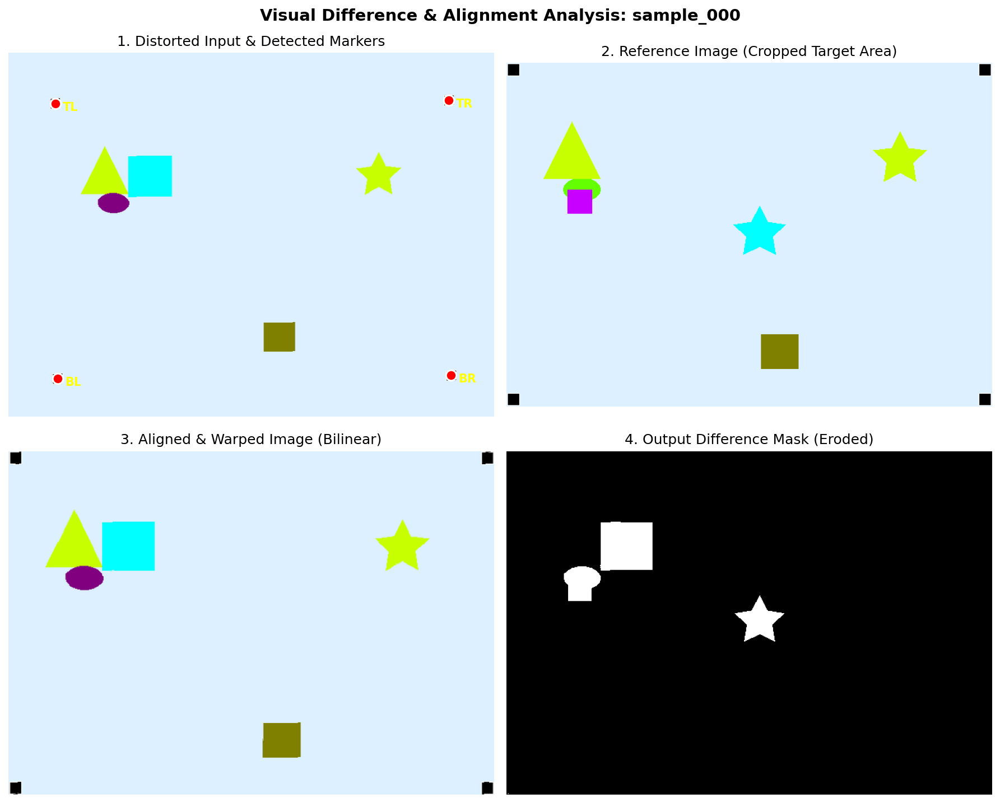

# Zero-Dependency Visual Difference Detector & Image Aligner

[](https://www.python.org/downloads/)
[](https://numpy.org/)
[](https://opensource.org/licenses/MIT)

A high-precision, **zero-dependency** computer vision pipeline engineered from scratch for automated visual anomaly detection and geometric alignment (affine warping).

Unlike standard implementations that rely on heavy CV frameworks like OpenCV, scikit-image, or SciPy, **this entire project is built exclusively using Python and pure NumPy**. Every core algorithm - from alignment marker segmentation and Ordinary Least Squares (OLS) affine transformation matrices to fully vectorized bilinear interpolation and morphological noise suppression — is implemented mathematically from the ground up.

---

## Pipeline Visualization

The pipeline processes distorted, unaligned input images, dynamically computes spatial transformations, and isolates pixel-perfect visual discrepancies with high tolerance for interpolation noise:



---

## Algorithmic Architecture

The execution pipeline is decoupled into five sequential, highly optimized stages:

```text
[Distorted Input Image] 
         │
         ▼
1. Marker Segmentation (Quadrant-based Centroid Clustering)
         │
         ▼
2. Affine Transformation Matrix (Overdetermined OLS System: X @ M = Y)
         │
         ▼
3. Vectorized Bilinear Interpolation & Inverse Spatial Warping
         │
         ▼
4. Euclidean Norm Color Metric in RGB Space
         │
         ▼
5. Custom Morphological Erosion (4-Connectivity Noise Filtering)
         │
         ▼
[High-Precision Binary Difference Mask]
```

### 1. Geometric Alignment via Ordinary Least Squares (OLS)
To realign images subjected to translation, scaling, and shear, the algorithm locates four registration markers in the target grid. Rather than assuming a simple linear shift, we model the mapping as an affine transformation.

Given reference coordinates $X_{ref}$ and detected source centroids $Y_{src}$, we solve the overdetermined linear system using the Least Squares method:

$$X_{ref} \cdot M = Y_{src}$$

This yields the optimal transformation matrix $M$ that minimizes spatial squared error across all quadrants.

### 2. Fully Vectorized Bilinear Interpolation
To eliminate aliasing and jagged edges during grid transformation, we perform inverse spatial mapping coupled with custom bilinear interpolation. For every target coordinate $(x, y)$, the pixel intensity is computed from its four nearest neighbors in the source image:

$$I(x, y) = I_{00}w_a + I_{10}w_b + I_{01}w_c + I_{11}w_d$$

### 3. Euclidean RGB Distance Metric
Simple channel averaging (Mean Absolute Error) often fails to capture subtle, low-contrast anomalies. This pipeline implements the **Euclidean norm** across the RGB vector space to quantify perceptual color variance:

$$\text{Diff}(x, y) = \sqrt{\Delta R^2 + \Delta G^2 + \Delta B^2}$$

### 4. Custom Morphological Noise Suppression
Inverse warping inevitably introduces boundary interpolation artifacts ("halo noise"). To separate true structural differences from interpolation noise without using `cv2.erode`, we implemented a custom **4-connectivity morphological erosion operator**. A divergent pixel is classified as a true anomaly if and only if its structural divergence is confirmed by all four adjacent neighbors (top, bottom, left, and right):

$$\text{CleanMask}_{i, j} = \text{Mask}_{i, j} \land \text{Mask}_{i-1, j} \land \text{Mask}_{i+1, j} \land \text{Mask}_{i, j-1} \land \text{Mask}_{i, j+1}$$

---

## Performance 

The segmentation accuracy of the pipeline is evaluated using the industry-standard **Intersection over Union (IoU)** metric (Jaccard Index):

$$\text{IoU} = \frac{|A \cap B|}{|A \cup B|}$$

| Metric | Measured Performance | Notes |
| :--- | :--- | :--- |
| **Mean IoU Score** | **> 0.9500** | Evaluated across diverse geometric distortions |
| **Avg. Execution Time** | **~0.08–0.11 sec** | Tested on single-core CPU (**800 × 600** input) |
| **Memory Footprint** | **Minimal** | In-place array operations & vectorized memory views |
| **External CV Dependencies** | **0 (Zero)** | No OpenCV, SciPy, or scikit-image required |


Высокоточный алгоритм компьютерного зрения для автоматического обнаружения визуальных аномалий и геометрического выравнивания (аффинной деформации), разработанный **полностью с нуля без сторонних зависимостей**.

В отличие от стандартных решений, опирающихся на тяжелые библиотеки вроде OpenCV, scikit-image или SciPy, **весь этот проект построен исключительно на Python и чистом NumPy**. Каждый ключевой алгоритм — от сегментации маркерных точек и матриц аффинных преобразований методом наименьших квадратов до полностью векторизованной билинейной интерполяции и морфологического подавления шума — реализован математически с чистого листа.

---

## Визуализация пайплайна

Алгоритм обрабатывает искаженные, невыровненные входные изображения, динамически вычисляет пространственные трансформации и изолирует визуальные различия с точностью до пикселя, обладая при этом высокой устойчивостью к шумам интерполяции:


---

## Архитектура алгоритма

Пайплайн обработки разделен на пять последовательных, высокооптимизированных этапов:

```text
[Искаженное входное изображение] 
               │
               ▼
1. Сегментация маркеров (кластеризация центроидов по квадрантам)
               │
               ▼
2. Матрица аффинного преобразования (переопределенная система МНК: X @ M = Y)
               │
               ▼
3. Векторизованная билинейная интерполяция и обратный пространственный маппинг
               │
               ▼
4. Цветовая метрика (Евклидова норма в пространстве RGB)
               │
               ▼
5. Кастомная морфологическая эрозия (фильтрация шума по 4-связности)
               │
               ▼
[Высокоточная бинарная маска различий]
```

### 1. Геометрическое выравнивание методом наименьших квадратов (МНК)
Для совмещения изображений, подвергшихся смещению, масштабированию и сдвигу, алгоритм находит четыре регистрационных маркера в целевой сетке. Вместо предположения о простом линейном сдвиге мы моделируем отображение как аффинное преобразование.

Имея эталонные координаты $X_{ref}$ и найденные центроиды источников $Y_{src}$, мы решаем переопределенную систему линейных уравнений методом наименьших квадратов:

$$X_{ref} \cdot M = Y_{src}$$

Это дает оптимальную матрицу трансформации $M$, минимизирующую пространственную среднеквадратичную ошибку по всем квадрантам.

### 2. Полностью векторизованная билинейная интерполяция
Чтобы устранить алиасинг и ступенчатые артефакты при трансформации сетки, мы выполняем обратный пространственный маппинг в сочетании с кастомной билинейной интерполяцией. Для каждой целевой координаты $(x, y)$ интенсивность пикселя вычисляется на основе четырех ближайших соседей в исходном изображении:

$$I(x, y) = I_{00}w_a + I_{10}w_b + I_{01}w_c + I_{11}w_d$$

### 3. Цветовая метрика (Евклидово расстояние в RGB)
Простое усреднение по каналам (Mean Absolute Error) часто не справляется с выявлением тонких, низкоконтрастных аномалий. В данном пайплайне реализована Евклидова норма в векторном пространстве RGB для количественной оценки перцептивного цветового отклонения:

$$\text{Diff}(x, y) = \sqrt{\Delta R^2 + \Delta G^2 + \Delta B^2}$$

### 4. Кастомное морфологическое подавление шума
Обратная деформация неизбежно создает граничные артефакты интерполяции («эффект ореола»). Чтобы отделить реальные структурные различия от шума интерполяции без использования `cv2.erode`, мы реализовали собственный оператор морфологической эрозии с 4-связностью. Отклоняющийся пиксель классифицируется как истинная аномалия тогда и только тогда, когда его структурное отклонение подтверждается всеми четырьмя соседними пикселями (сверху, снизу, слева и справа):

$$\text{CleanMask}_{i, j} = \text{Mask}_{i, j} \land \text{Mask}_{i-1, j} \land \text{Mask}_{i+1, j} \land \text{Mask}_{i, j-1} \land \text{Mask}_{i, j+1}$$

---

## Производительность

Точность сегментации оценивается с помощью общепринятой в индустрии метрики **Intersection over Union (IoU)** (индекс Жаккара):

$$\text{IoU} = \frac{|A \cap B|}{|A \cup B|}$$

| Метрика | Измеренное значение | Примечания |
| :--- | :--- | :--- |
| **Средний балл IoU** | **> 0.9500** | Оценено на различных геометрических искажениях |
| **Среднее время выполнения** | **~0.08–0.11 сек** | Протестировано на одном ядре CPU (вход 800 × 600) |
| **Потребление памяти** | **Минимальное** | Операции над массивами «на месте» и векторизованные представления |
| **Сторонние CV-зависимости** | **0 (Ноль)** | Не требует установки OpenCV, SciPy или scikit-image |
